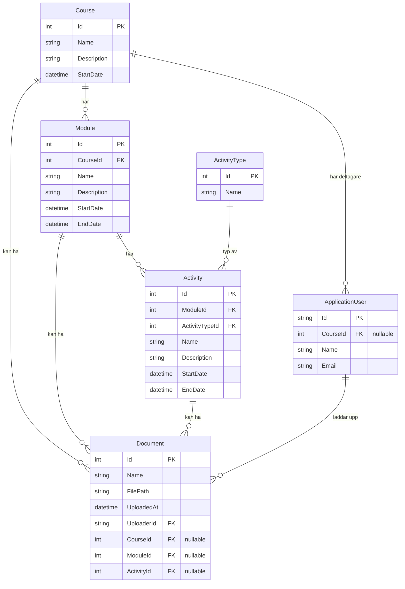

# Lexicon LMS – grupp 4

> **Tillfällig README.** Den uppdateras när LMS-templaten läggs in i repot.

Slutprojekt på Lexicon: en lärplattform (LMS) byggd med Blazor Web App, remote API, YARP/BFF och EF Core.

## Länkar

| Vad | Länk |
|---|---|
| Projektboard | https://github.com/orgs/Lexicon-grupp4/projects/1 |
| Azure (LMS.API) | https://lms-grupp4-ebaygyhdcwhzbkgg.swedencentral-01.azurewebsites.net/ |
| Deploy-workflow | [`.github/workflows/main_lms-grupp4.yml`](.github/workflows/main_lms-grupp4.yml) |

## Datamodell

> Utkast. Uppdateras när entiteterna är bestämda och skapade i `Domain.Models`.



## Branches

| Branch | Syfte |
|---|---|
| `main` | Verifierade leveranser. Push hit deployar till Azure. Inga direkta commits. |
| `development` | Default-branch. Alla feature-PRs går hit. |
| `feature/usXX-kort-namn` | Ny funktionalitet, t.ex. `feature/us04-modules` |
| `bugfix/kort-namn` | Buggrättningar, t.ex. `bugfix/submission-deadline` |

## Arbetsflöde

1. Välj en sub-issue på boarden, tilldela dig själv och flytta den till **In progress**.
2. Skapa en branch från `development`, gärna direkt från issuet:
   ```bash
   gh issue develop <nr> --name feature/us04-modules --base development --checkout
   ```
3. Implementera och verifiera lokalt.
4. Öppna en PR mot `development`. Skriv `Closes #nr` för varje sub-issue som PR:n färdigställer.
5. En annan gruppmedlem granskar och godkänner.
6. Merge. Sub-issues stängs och flyttas till **Done** automatiskt.
7. `development` → `main` via PR när gruppen har en verifierad leveranspunkt.

Håll högst 2–3 PRs samtidigt i Ready for review. Prioritera review när kön växer.

## Statusar på boarden

| Status | Betydelse |
|---|---|
| Backlog | Kravet finns men är inte valt för aktivt arbete. |
| Sprintbacklog | Valt för den aktuella sprinten. |
| In progress | Någon arbetar aktivt med uppgiften. |
| In review | En PR är Ready for review. |
| Done | Granskat, mergat och verifierat. |

## Definition of Done

- [ ] Uppfyller issuebeskrivningen och berörda acceptance criteria.
- [ ] Bygger utan fel och kan startas.
- [ ] Server-side validering och authorization är på plats.
- [ ] Databasändringar har en fungerande migration.
- [ ] Klientens API-anrop går via YARP/BFF-flödet.
- [ ] Testscenarier kontrollerade, automatiserade tester passerar.
- [ ] PR granskad av minst en annan gruppmedlem och kommentarer hanterade.
- [ ] Mergad till `development` och berörda sub-issues stängda.
- [ ] README uppdaterad vid ändrad installation eller konfiguration.

Sprint Goal 1
Skapa en stabil grund för LMS:et genom att verifiera templaten och GitHub-flödet samt bygga den grundläggande strukturen för användare och kurser.

## Kom igång

_Fylls i när templaten finns: krav (.NET 10 SDK), secrets, databas och hur API och Blazor startas._

## Deploy

Push till `main` kör GitHub Actions som bygger och publicerar `LMS.API` till Azure App Service `lms-grupp4`. Azure-inloggningen gäller bara körningar från `main`.
